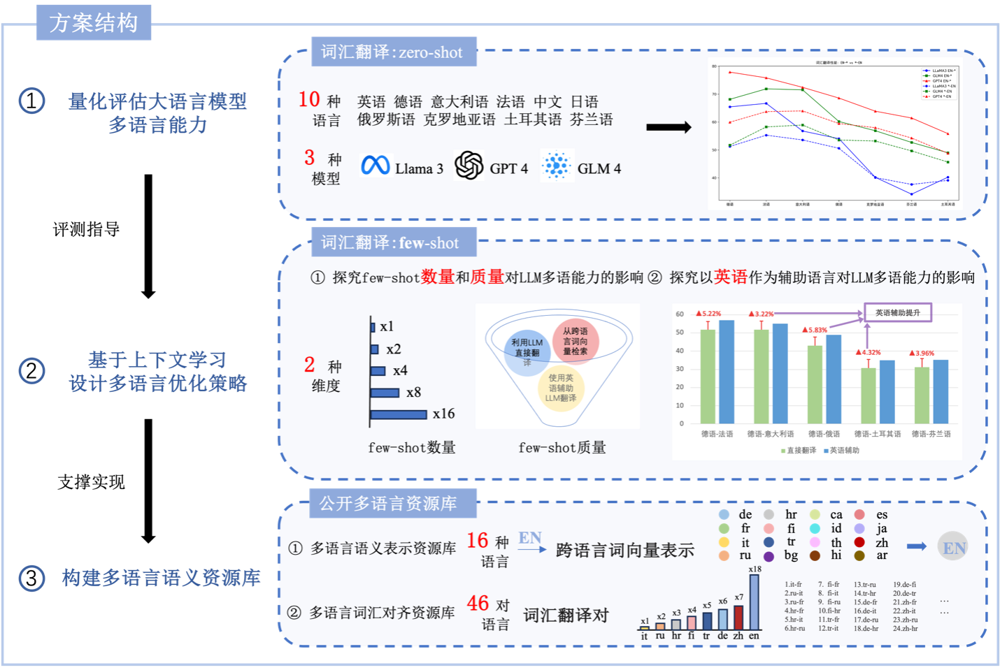

# LLMMultilingualCapacity
## 项目目的
1）测评大语言模型zero-shot的多语能力（以词汇翻译任务为切入点）

2）探究上下文策略对大语言模型多语能力的影响

3）构建新的多语言语义资源库(多语言词汇对齐资源库，多语言语义表示资源库)

## 项目实施方案



## 项目文件说明
1）bli_datasets: 是本次评估使用的数据集，分别来自于[xling-eval-master](https://github.com/codogogo/xling-eval)和[MUSE](https://github.com/facebookresearch/MUSE)

2）GLM-4-Plus/GPT-4/LLaMA3: 是本次评估以及探究上下文策略对大语言模型多语能力的影响的实操代码
   
3）near_words_32: 基于[fastText Wikipedia embeddings](https://fasttext.cc/docs/en/pretrained-vectors.html)，针对与每种语言提取出的与之语义相近的前32个词，用于探究上下文学习few-shot对模型多语能力的影响 

4）多语言语义表示库：其中，多语言语义表示资源库提供了16种其他语言至英语的跨语言对齐词向量表示；多语言词汇对齐资源库提供了包含46对语言对的词汇翻译对齐库，可用于评测LLMs多语言能力。


## 代码指令说明

```bash
# Part1: zeor-shot基础测评
python 模型名称_zero_shot.py --src_lang xx --trg_lang xx 
python llama3_zero_shot.py --src_lang de --trg_lang fi

# Part2: 上下文策略对大语言模型多语能力的影响
1.few-shot 数量的影响
python 模型名称_few_shot_[1-32].py --src_lang xx --trg_lang xx --number few_shot数量
python llama3_few_shot_[1-32].py --src_lang de --trg_lang fi --number 1

2.few-shot 质量的影响
1) 直接1-shot 
python 模型名称_1_shot.py --src_lang xx --trg_lang xx
python glm_1_shot.py --src_lang de --trg_lang ru
2）英语辅助的1-shot
python 模型名称_1_shot_en_aid.py --src_lang xx --trg_lang xx
python glm_1_shot_en_aid.py --src_lang de --trg_lang ru
3）从跨语言词向量中获取的1-shot
python 模型名称_few_shot_[1-32].py --src_lang xx --trg_lang xx --number 1
python glm_few_shot_[1-32].py --src_lang de --trg_lang fr --number 1

3. 英语作为辅助语言对其的影响
python 模型名称_en_aid.py --src_lang xx --trg_lang xx
python llama3_en_aid.py --src_lang tr --trg_lang fi
